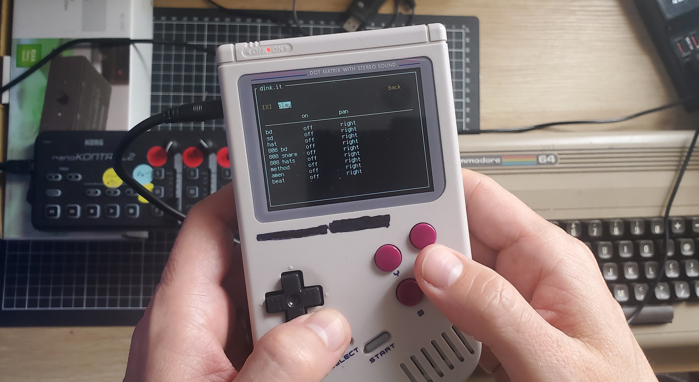

Tracker module live performance device.

This application is designed for performing live with tracker modules on a handheld device.
The hardware is a Gpi case for the Raspberry Pi zero.

To run the app on the device: `./main.sh`

To run the app in dev mode on a laptop: `./dev.sh`



# Set high priority realtime audio

```
sudo cat<<EOT > /etc/security/limits.d/audio.conf
@audio   -  rtprio     95
@audio   -  memlock    unlimited
EOT
```

# Dependencies

 * [Python 3](https://python.org)
 * [`xmp`](https://github.com/libxmp/libxmp)
 * [`pd`](https://puredata.info/)

`sudo apt install xmp python3 puredata`
